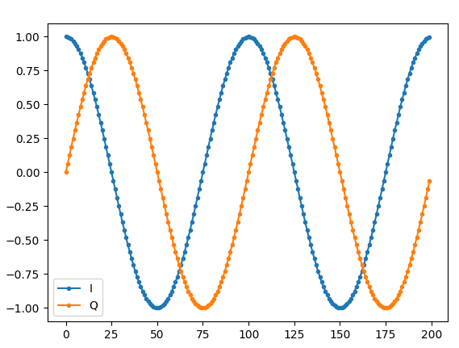
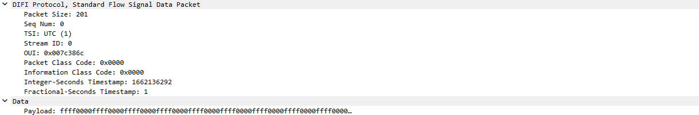

# DIFI 101 Tutorial

## What is DIFI

The DIFI Packet Protocol, technically referred to as "IEEE-ISTO Std 4900-2021:  Digital IF Interoperability Standard", defines a data plane interface meant for transmitting and receive digitized IF data (such as IQ samples) and corresponding metadata over standard IP networks. Even though it is called an IF standard, IQ samples at baseband can also be streamed with DIFI.  The DIFI interface is designed to be fully compliant with the widely used VITA 49.2 standard, VITA 49 is a very flexible standard, and DIFI is a specific VITA 49 schema.  By creating a specific schema of VITA 49.2, interoperability between devices and software is more achievable.  The primary use-case of DIFI packets is to create an interface between satellite ground station digitizers (transceivers) and software modems, enabling interoperability and combatting vendor lock-in that has plagued the satellite industry for decades.  The DIFI packet protocol can also be used for other purposes, including applications that don't involve satellites or even hardware, such as streaming an RF signal between different software applications.  The DIFI standard is currently being created by the [DIFI Consortium](https://dificonsortium.org/), although version 1 of the standard has been locked in, and contains all of the functionality we will discuss in this tutorial. 


## Overview of the DIFI Specifications

The DIFI packet protocol defines the payload of UDP packets, although some vendors have implemented TCP versions as well, even though it's not officially part of the specifications.  Like any TCP/UDP packets, the max packet size (the Ethernet frame payload) is adjustable from 128 octets to 9000 octets, which will determine how many IQ samples can be sent in each packet.

There are three types of DIFI packets: signal data, signal context, and version context.  The signal context packet includes fields such as timestamp, bandwidth, RF frequency, gain, sample rate, and the data format used within the signal data packets.  The version context packet is even shorter and is used to convey version information for the software/firmware sending the DIFI packets, as well as the DIFI spec version being used (currently there is just one option). Lastly, the signal data packets contain the actual signal, in the form of IQ samples, as well as a timestamp that includes both integer and fractional seconds, to mark the precise time of the first sample.  The number of data packets sent per second is determined by the sample rate, and the MTU size (which determines the samples per packet).  Context packets are either sent periodically or as needed, e.g., when a parameter changes.  Version packets are sent periodically, such as once per second.

Regarding the specific data type used for the IQ samples, DIFI uses fixed point signed integers, where each integer can be 4 through 16 bits (specified in the signal context packet).  DIFI does not use zero padding, so for bit depths other than 8 and 16, the integers share bytes, and the samples per packet must lead to an even number of 4-byte words in the packet.

All DIFI packets also have a 4-bit sequence number that can be used to deal with out of order packets at the destination.  They also all have a stream ID which defaults to 0 but can be set to something else in order to have multiple independent streams over the same port (it is up to the receiving side to choose to filter off stream ID).

## How to Use DIFI 

There are multiple ways you can use DIFI in your application.  If you are using GNU Radio, there are blocks in the out-of-tree module [gr-difi](https://github.com/DIFI-Consortium/gr-difi) that provide DIFI Source and DIFI Sink functionality to GNU Radio, so that you can send or receive DIFI packets using UDP or TCP.  There is also the Python code in the DIFI_Validator directory which provides methods for generating and parsing DIFI packets.  On the hardware side, there are vendors such as [Kratos](https://www.kratosdefense.com/products/space/networks/network-devices/spectralnet) who make digitizers (transceivers) that can communicate over DIFI.  If you use USRP SDRs, there will soon be a UHD C++ application added to this repo that will generate DIFI packets, as well as an RFNoC block that allows a USRP to generate DIFI packets on a different interface than that used for UHD control.

## Creating DIFI Packets in Python

We will now create an example DIFI signal data packet in Python, without requiring any dependencies other than numpy and matplotlib, to demonstrate how it works.

For reference, and because the DIFI specifications are behind a pay-wall, the signal data packet structure is depicted below, using 4 bytes per line:

```
+-+-+-+-+-+-+-+-+-+-+-+-+-+-+-+-+-+-+-+-+-+-+-+-+-+-+-+-+-+-+-+-+
|Pckt T.|C|Indi.| T.|TSF|Seq Num|          Packet Size          |
+-+-+-+-+-+-+-+-+-+-+-+-+-+-+-+-+-+-+-+-+-+-+-+-+-+-+-+-+-+-+-+-+
|                           Stream ID                           |
+-+-+-+-+-+-+-+-+-+-+-+-+-+-+-+-+-+-+-+-+-+-+-+-+-+-+-+-+-+-+-+-+
|    Pad  |  Res|                      OUI                      |
+-+-+-+-+-+-+-+-+-+-+-+-+-+-+-+-+-+-+-+-+-+-+-+-+-+-+-+-+-+-+-+-+
|           Info Class          |          Packet Class         |
+-+-+-+-+-+-+-+-+-+-+-+-+-+-+-+-+-+-+-+-+-+-+-+-+-+-+-+-+-+-+-+-+
|                      Integer Sec Timestamp                    |
+-+-+-+-+-+-+-+-+-+-+-+-+-+-+-+-+-+-+-+-+-+-+-+-+-+-+-+-+-+-+-+-+
|                  Fractional-Seconds Timestamp                 |
|                                                               |
+-+-+-+-+-+-+-+-+-+-+-+-+-+-+-+-+-+-+-+-+-+-+-+-+-+-+-+-+-+-+-+-+
|                                                               |
|                                                               |
|                                                               |
|       Signal Data Payload Complex 4-16 bit signed N Words     |
|                                                               |
|                                                               |
|                                                               |
+-+-+-+-+-+-+-+-+-+-+-+-+-+-+-+-+-+-+-+-+-+-+-+-+-+-+-+-+-+-+-+-+
```

The following code creates a valid DIFI signal data packet, filled with repeating 1's and 0's for the IQ samples.  In the later portion of this tutorial we will create code that can parse this packet, but first we will dissect it in Wireshark.

Save the following code into a file called difi_tx.py, and then run it with `python difi_tx.py`.  If you have issues running it you may have to first run `sudo pip install numpy matplotlib` (remove sudo if not on Linux), which assumes you already have pip installed.

``` python
import socket
import time
import numpy as np
import matplotlib.pyplot as plt

DESTINATION_IP = '127.0.0.1'  # dest address to send packets to
DESTINATION_PORT = 1234  # dest port to send packets to
STREAM_ID = 0  # 32 bit int id of stream

# 1st 16 bits of header in hex
pkt_type = "1"

clsid = "1" # 1 bit
rsvd = "00" # 2 bits
tsm = "0" # 1 bit
tsi = "01" # 2 bits
tsf = "10" # 2 bits
clsid_rsvd_tsm_tsi_tsf_binary = clsid + rsvd + tsm + tsi + tsf # 10000110
clsid_rsvd_tsm_tsi_tsf_dec = int(clsid_rsvd_tsm_tsi_tsf_binary, 2) # decimal version
clsid_rsvd_tsm_tsi_tsf = "%02x" % clsid_rsvd_tsm_tsi_tsf_dec # hex version

seqnum = 0

# create the socket
udp_socket = socket.socket(socket.AF_INET,socket.SOCK_DGRAM)

difi_packet = bytearray() # prep vita/difi payload

first_half_header = "%s%s%s" % (pkt_type, clsid_rsvd_tsm_tsi_tsf, seqnum)
packetchunk = bytearray.fromhex(first_half_header) #(1A61) #clsid=0x1,tsm=0x0,tsf=0x2
difi_packet.extend(packetchunk)

# 2nd 16 bits of header in hex, (Packet Size)
difi_packet.extend(bytearray.fromhex("00C9")) # C9 is 201 which tells us how many words are in the packet

difi_packet.extend(STREAM_ID.to_bytes(4, 'big'))
          
difi_packet.extend(bytearray.fromhex("000012A2")) # XX:000012A2  XX:OUI for Vita
             
difi_packet.extend(bytearray.fromhex("00000000")) # Info Class Code, Packet Class Code #icc=0x0000,pcc=0x0000

packet_timestamp = format(int(time.time()),'x') # Integer timestamp
difi_packet.extend(bytearray.fromhex(packet_timestamp))

difi_packet.extend(bytearray.fromhex("0000000000000001")) # Fractional Timestamp

for _ in range(0,201-7): # header is 7 words
    difi_packet.extend(bytearray(b'\xFF\xFF')) # 16 bits of ones
    difi_packet.extend(bytearray(b'\x00\x00')) # 16 bits of zeros

length = len(difi_packet)
print(f'Length of this bytes object is {length} bytes and {length/4} 32 bit words')

udp_socket.sendto(difi_packet, (DESTINATION_IP, DESTINATION_PORT))
```

You can feel free to change the IQ samples, or put a loop around it to send multiple packets.  

### Simulating a Signal

To make things more interesting, we will simulate a baseband signal, and use the IQ samples in place of the 1's and 0's we had above.  When your IQ samples start as a numpy array, you can convert them to integers of the correct datatype (e.g., int16), and then use `bytearray()` to generate the bytearray associated with the samples, as shown below.  Replace the `for` loop in the code above with the code below:

``` python
# Simulate a signal instead of 1's and 0's
N = 200 # number of IQ samples, which will equate to 4x as many bytes
f = 0.01
t = np.arange(N)
signal = 1000*np.exp(1j*2*np.pi*t*f)
if False:
    plt.plot(signal.real, '.-')
    plt.plot(signal.imag, '.-')
    plt.legend(['I','Q'])
    plt.show()
# Deinterleave the IQ so it's a bunch of ints in a row (IQIQIQIQ...)
deinterleaved_signal = np.zeros(len(signal)*2, dtype=np.int16)
deinterleaved_signal[::2] = signal.real
deinterleaved_signal[1::2] = signal.imag
signal_bytearray = bytearray(deinterleaved_signal)
difi_packet.extend(signal_bytearray) # add it to the packet
# Note that at this point, the Packet Size defined before should be updated, it's currently hardcoded
```

For the signal we generated a complex exponential (essentially, a sine wave), which looks like the following:



## Dissecting a DIFI Packet in Wireshark

We will now dissect the signal data packet we generated using the code in the previous section.  Install [Wireshark](https://www.wireshark.org/) and then copy the [DIFI plugin](/wireshark-dissector/difi-dissector.lua) to the Wireshark plugins directory. For Windows the directory has the following path:

     `C:\Users\<username>\AppData\Roaming\Wireshark\plugins`

 If using Linux:

    `~./local/lib/wireshark/plugins`

Run Wireshark, and verify the plugin is loaded under Help->About Wireshark->Plugins.

To capture the packet we generate with our code, enter "port 1234" into the filter text box, which is the port our code was set to use, and then select the interface "Adapter for loopback", as shown below:


Hit the Start button, which is the shark fin on the top-left, then trigger a packet by running the code from the previous section.  You should see a packet pop up in Wireshark as a new line, click on it to see the details.  We can see the 1's and 0's, as well as the other fields included in the packet. For more details on how the dissector works, you can reference the README and .lua file in the wireshark-dissector directory.



## Parsing DIFI Packets in Python

Instead of using Wireshark to parse the packet, we will do it ourselves in Python.  The following script receives UDP packets on a specified port, and then parses packets that are found to have the DIFI data packet type (it doesn't support parsing context or version packets, see the DIFI_Validator code if that is your goal).  This is meant to provide an example of how to receive packets in Python, parse the bytes, and pull out the DIFI fields.  

To exit the application you may have to hit control-C, and then send another packet, for it to fully exit.

``` python
from datetime import timezone, datetime
import struct
import io
import socket
import numpy as np
import matplotlib.pyplot as plt

DIFI_RECEIVER_ADDRESS = "0.0.0.0"
DIFI_RECEIVER_PORT = 1234

# DIFI packet types
DIFI_STANDARD_FLOW_SIGNAL_CONTEXT = 0x4
DIFI_VERSION_FLOW_SIGNAL_CONTEXT = 0x5
DIFI_STANDARD_FLOW_SIGNAL_DATA = 0x1

def decode_difi_packet(stream: io.BytesIO):
    # get packet type
    tmpbuf = stream.read1(4)
    (value,) = struct.unpack(">I", tmpbuf)
    packet_type = (value >> 28) & 0x0f   #(bit 28-31)
    print("packet type:", packet_type)

    # get stream id
    tmpbuf = stream.read1(4)
    (value,) = struct.unpack(">I", tmpbuf)
    stream_id = value
    print("stream id:", stream_id)

    stream.seek(0) #reset stream back to beginning

    if packet_type != DIFI_STANDARD_FLOW_SIGNAL_DATA:
        print("Packet type parsing not implemented")

    # decode 32bit header (4 bytes)
    hdrbuf = stream.read1(4)
    (hdr,) = struct.unpack(">I", hdrbuf)
    pkt_type = (hdr >> 28) & 0x0f     #(bit 28-31)
    class_id = (hdr >> 27) & 0x01     #(bit 27)
    reserved = (hdr >> 25) & 0x03     #(bit 25-26)
    tsm = (hdr >> 24) & 0x01          #(bit 24)
    tsi = (hdr >> 22) & 0x03          #(bit 22-23)
    tsf = (hdr >> 20) & 0x03          #(bit 20-21)
    seq_num = (hdr >> 16) & 0x0f      #(bit 16-19) #mod16 of pkt count (seqnum in difi spec)
    pkt_size = (hdr >> 0) & 0xffff    #(bit 0-15) #num 32bit words in pkt

    # decode stream id (4 bytes)
    idbuf = stream.read1(4)
    (value,) = struct.unpack(">I", idbuf)
    stream_id = value
    stream.seek(4) #backup to 4 to re-include stream id in data for decoding below

    print("---")
    print("DifiDataPacket header data in constructor:")
    print("Header: %s" % (hdrbuf.hex()))
    print("Header: %d" % (int.from_bytes(hdrbuf, byteorder='big', signed=False)))
    print(f"Header: {(int.from_bytes(hdrbuf, byteorder='big', signed=False)):032b}")
    print("stream id: 0x%08x" % (stream_id))
    print("pkt type: 0x%01x" % (pkt_type))
    print("classid: 0x%01x" % (class_id))
    print("reserved: 0x%01x" % (reserved))
    print("tsm: 0x%01x" % (tsm))
    print("tsi: 0x%01x" % (tsi))
    print("tsf: 0x%01x" % (tsf))
    print("pkt count (mod16): %d" % (seq_num))  #packet_count
    print("pkt size: %d" % (pkt_size)) #packet_size
    print("---")

    packet_size_in_bytes = (pkt_size - 1) * 4  #less header (-1)
    context_data = stream.read1(packet_size_in_bytes)

    # Stream ID (5.1.2)
    print(context_data[0:4].hex())
    print(" Stream ID = 0x%08x (ID)" % (stream_id))

    # OUI (5.1.3)
    print(context_data[4:8].hex())
    (value,) = struct.unpack(">I", context_data[4:8])
    value = value & 0x00FFFFFF
    print(" OUI = 0x%06x" % (value))

    # Information Class Code / Packet Class Code (5.1.3)
    (icc,pcc) = struct.unpack(">HH", context_data[8:12])
    print(" Information Class Code = 0x%04x - Packet Class Code = 0x%04x" % (icc, pcc))

    # Integer-seconds Timestamp (5.1.4 and 5.1.5)
    (value,) = struct.unpack(">I", context_data[12:16])
    print(" Integer-seconds Timestamp (seconds since epoch) = %d (%s)" % (value, datetime.fromtimestamp(value, tz=timezone.utc).strftime('%m/%d/%Y %r %Z')))

    # Fractional-seconds Timestamp (5.1.4 and 5.1.5)
    print(context_data[16:24].hex())
    (value,) = struct.unpack(">Q", context_data[16:24])
    print(" Fractional-seconds Timestamp (picoseconds past integer seconds) = %d" % (value))

    # Signal Data Payload
    # payload size is size minus 28 bytes for difi headers (7 words * 4 bytes per word) = 28 bytes
    # already removed 1st word of header earlier above (28 bytes - 4 bytes) = 24 bytes
    payload_data_size_in_bytes = len(context_data) - 24
    payload_data_num_32bit_words = (len(context_data) - 24) / 4
    print(" Payload Data Size = %d (bytes), %d (32-bit words)" % (payload_data_size_in_bytes, payload_data_num_32bit_words))

    signal_bytes = context_data[24:]
    signal =  np.frombuffer(signal_bytes, dtype=np.int16) # assumes int16s of IQ
    signal = signal[::2] + 1j*signal[1::2] # interleave the IQ
    if True:
        plt.plot(signal.real, '.-')
        plt.plot(signal.imag, '.-')
        plt.legend(['I','Q'])
        plt.show()

######################################
# main script
######################################

#create UDP socket listener
sock = socket.socket(socket.AF_INET, socket.SOCK_DGRAM)

#bind to port
server_address = (DIFI_RECEIVER_ADDRESS, DIFI_RECEIVER_PORT)
print('starting UDP listener on {} port {}...'.format(*server_address))
sock.bind(server_address)

#listen for packets
recv_count = 0
while True:
    print('waiting to receive packet data...')
    data, address = sock.recvfrom(9216) # max data packet 9000 bytes, per difi spec
    recv_count+=1
    print('received {} bytes from {}. [count={}]'.format(len(data), address, recv_count))
    print("packet data received: {}".format(data))
    stream = io.BytesIO(data)
    decode_difi_packet(stream)
```