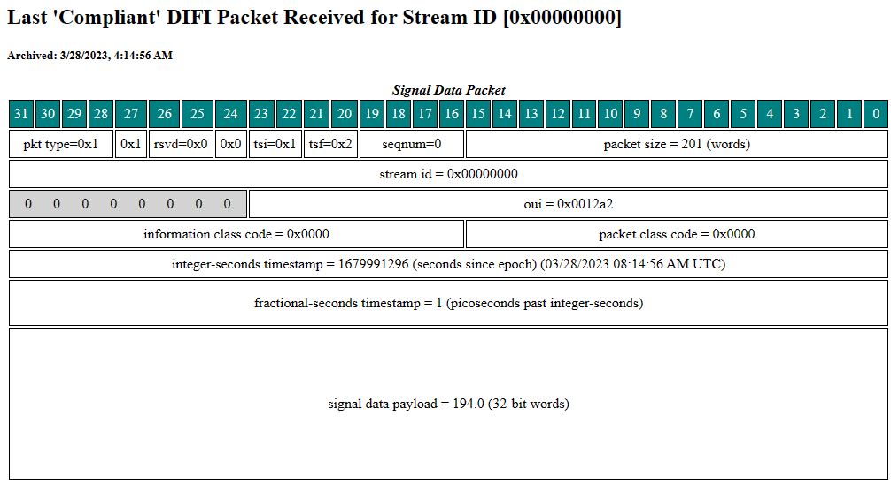

# Intro

This directory contains a **DIFI** validation tool to aid with interoperability of DIFI sources and sinks.  For an introduction to DIFI, please see the [DIFI 101 tutorial](https://github.com/DIFI-Consortium/DIFI-Certification/blob/main/DIFI_101_Tutorial.md).  Note that the official DIFI specification document is located [here](https://dificonsortium.org/standards/) behind an IEEE download/registration page.  DIFI is a specific implementation/subset of the VITA 49.2 framework, and as such, knowledge of VITA 49 is helpful, see VITA Radio Transport (VRT) Standard, VITA-49.2 – 2017.

This DIFI validation tool can be used as a stand-alone application that decodes and verifies whether packets in a packet stream are in compliance with the DIFI 1.0 or 1.1 standard, and can prepare and send DIFI compliant packets for testing purposes. The code consists of several Python modules, which you can import into your own scripts/applications.

The source code is split into the following files:

- drx.py - Receives and decodes packets, includes a socket-based app
- dcs.py - Creates Context packets
- dds.py - Creates Data packets
- dvs.py - Creates Version packets
- webgui.py - Flask REST API/server code that makes a web UI to go along with the drx.py app

Each has a `--help` option for more info on running it directly

See the [Docker README](docker/README.md) for instructions on running webgui.py in a containerized manner.

For questions/comments on the Validator tool, reach out to Marc.

# Running a PCAP through the Validator

```bash
cd DIFI_Validator
sudo apt update
sudo apt install libxml2-dev
sudo pip install -r requirements.txt
export DIFI_RX_MODE=pcap
export PCAP_FILE=/path/to/your/pcap/filename.pcap
python drx.py
```

Optionally, `export LEGACY_MODE=True`

# Basic Tutorial

In one terminal, run the web GUI component:

```bash
cd DIFI_Validator
sudo pip install -r requirements.txt
python webgui.py
```

Now open a browser to http://127.0.0.1:5000 and you should see the web UI:


In a second terminal, run the drx.py component:

```bash
cd DIFI_Validator
python drx.py
```

This will receive DIFI packets on port 4991 by default

In a third terminal, we will send an example DIFI packet to drx.py.  Open [DIFI 101 tutorial](../DIFI_101_Tutorial.md#Creating_DIFI_Packets_in_Python) section on "Creating DIFI Packets in Python", and run the example code using a DESTINATION_PORT of 4991.  It may be easier to copy/paste this code into a new .py script and run it with `python myscript.py`.  You should see that the terminal running drx.py shows a data packet being received.

In the web GUI (in your browser) change the Stream ID to 0x00000000 and click the "See latest good data packet" button.  If all went well, you should be brought to this screen:



Just to reiterate what happened here, the drx.py app is what ultimately recieved and processed the packet which was crafted and sent by your script.  The webgui app simply provides a convinient interface for seeing the results of drx.py.

The webgui app also lets you generate DIFI packets, it essentially calls dcs.py, dds.py, and dvs.py using parameters you specify in the webgui (vs command line if you want to skip using the webgui).  We can create another data packet using the "Send a data packet" button, try setting the stream id to 0 and target port to 4991, the hit send packet.  Now back on the main page, if you click "See count of good packets", there should now be 2.

# Misc Examples

## Example of validating a DIFI packet

```Python
import drx
import io
try:
    drx.DEBUG = False
    drx.VERBOSE = False

    b = bytearray(b'<put full packet byte data here>')
    stream = io.BytesIO(b)

    pkt = drx.process_data(stream) # use this to read DIFI VRT packet from byte stream (can be any packet type)
    print(pkt)
    print(pkt.to_json())
    print(pkt.to_json(hex_values=True))

except drx.NoncompliantDifiPacket as e:
    print("error: ", e.message)
    print("--> not DIFI compliant, packet not decoded:\r\n%s" % e.difi_info.to_json())
except Exception as e:
    print("error: ", e)

```

## To check if header in packet is DIFI compliant:

```Python
import drx
try:
    pkt = drx.DifiVersionContextPacket
    
    if pkt.is_difi10_version_context_packet_header(pkt,
        packet_type=drx.DIFI_VERSION_FLOW_SIGNAL_CONTEXT,
        class_id=drx.DIFI_CLASSID,
        rsvd=drx.DIFI_RESERVED,
        tsm=drx.DIFI_TSM_GENERAL_TIMING,
        tsf=drx.DIFI_TSF_REALTIME_PICOSECONDS,
        packet_size=drx.DIFI_VERSION_FLOW_SIGNAL_CONTEXT_SIZE) is True:

        print("valid...")
    else:
        print("not valid...")

except Exception as e:
    print("error: ", e)
```

## To check if packet contents are DIFI compliant (i.e. packet fields after the header):
```Python
import drx
try:
    pkt = drx.DifiVersionContextPacket
    
    if pkt.is_difi10_version_context_packet(pkt,
        icc=drx.DIFI_INFORMATION_CLASS_CODE_VERSION_FLOW_CONTEXT,
        pcc=drx.DIFI_PACKET_CLASS_CODE_VERSION_FLOW_CONTEXT,
        cif0=drx.DIFI_CONTEXT_INDICATOR_FIELD_0_VERSION_FLOW_CONTEXT,
        cif1=drx.DIFI_CONTEXT_INDICATOR_FIELD_1_VERSION_FLOW_CONTEXT,
        v49_spec=drx.DIFI_V49_SPEC_VERSION_VERSION_FLOW_CONTEXT) is True:

        print("valid...")
    else:
        print("not valid...")

except Exception as e:
    print("error: ", e)
```

## Example of generating version packet

```Python
import dvs
try:
    dvs.DESTINATION_IP = "10.1.1.1"   #it will send this version packet to this destination server address
    dvs.DESTINATION_PORT = 4991
    dvs.STREAM_ID = 1
    dvs.FIELDS["--pkt-type"] = "5"
    dvs.FIELDS["--clsid"] = "1"
    dvs.FIELDS["--rsvd"] = "0"
    dvs.FIELDS["--tsm"] = "1"
    dvs.FIELDS["--tsi"] = "1"
    dvs.FIELDS["--tsf"] = "2"
    dvs.FIELDS["--seqnum"] = "0"
    dvs.FIELDS["--pkt-size"] = "000b"
    dvs.FIELDS["--oui"] = "0012A2"
    dvs.FIELDS["--icc"] = "0001"
    dvs.FIELDS["--pcc"] = "0004"
    dvs.FIELDS["--integer-seconds-ts"] = "1"
    dvs.FIELDS["--fractional-seconds-ts"] = "1"
    dvs.FIELDS["--cif0"] = "80000002"
    dvs.FIELDS["--cif1"] = "0000000C"
    dvs.FIELDS["--v49-spec-version"] = "00000004"
    dvs.FIELDS["--year"] = "22"
    dvs.FIELDS["--day"] = "1"
    dvs.FIELDS["--revision"] = "0"
    dvs.FIELDS["--type"] = "1"
    dvs.FIELDS["--icd-version"] = "0"
    dvs.send_difi_compliant_version_context_packet()
except Exception as e:
    print(e)

```