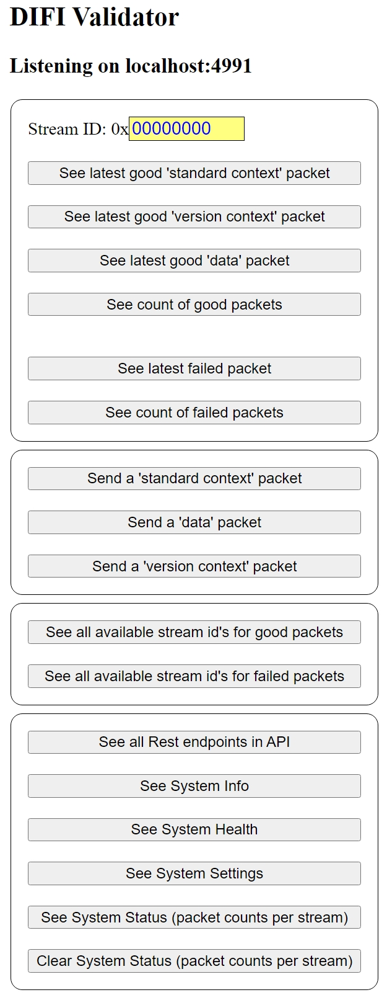

Copyright © `2022` `Kratos Technology & Training Solutions, Inc.`
Copyright © `2023` `Microsoft Corporation`
Licensed under the MIT License.
SPDX-License-Identifier: MIT

## Build and Run the Docker Image

Note: This application starts a UDP socket server that listens for DIFI packets from a device, and starts a Flask server that listens for HTTP requests for API endpoints and GUI. There are three server deployment options for Flask when building the Docker container:

1. DEV - Using Flask's built-in dev server, this is the simplest but not meant for production
2. PROD - Using a uWSGI server that runs the Flask app
3. PROD-GATEWAY - Using a NGINX server proxying to the uWSGI server hosting flask app

### DEV Deployment (simplest option)

```bash
cd DIFI_Validator
docker build --force-rm -f docker/Dockerfile -t difi .
docker run -it -p 5000:5000 -e DIFI_RX_PORT=4991 -e DIFI_RX_MODE=socket -e FLASK_DEPLOY_ENV=dev difi
```

Open a browser to http://127.0.0.1:5000 to access the web UI:



Notes: 
- You may or may not have to add `sudo` before each docker command
- This will run a development flask server, listening on port 5000
- For a fresh build, include the `--no-cache` flag
- To run the docker container in the background, add `-d` after `-it`

### PROD (proxy server) Deployment

To run using an nginx server proxying to uwsgi server hosting flask app (instead of the flask dev server) do this instead:

```bash
docker build --build-arg USER=nginx --build-arg GROUP=nginx --build-arg UID=2000 --build-arg GID=2000 --force-rm -f docker/Dockerfile -t difi .
docker run -it -p 5000:5000 -e DIFI_RX_PORT=4991 -e DIFI_RX_MODE=socket -e FLASK_DEPLOY_ENV=prod difi
```

### PROD-GATEWAY (application-gateway) Deployment

The last method sets up a nginx server called through application gateway unix domain socket to uwsgi server hosting the flask app:

```bash
sudo addgroup -gid 2000 nginx
sudo adduser --system --home /var/www --uid 2000 --gid 2000 --disabled-login nginx
docker build --build-arg USER=nginx --build-arg GROUP=nginx --build-arg UID=2000 --build-arg GID=2000 --force-rm -f docker/Dockerfile -t difi .
docker run -it -p 5000:5000 -v /tmp:/tmp -e DIFI_RX_PORT=4991 -e DIFI_RX_MODE=socket -e FLASK_DEPLOY_ENV=prod-gateway difi
```

Notes:
-  When debugging and testing flask server running in 'application gateway' server option mode, 'curl' doesn't work, because curl sends 'http' protocol packets to the unix socket (/tmp/difi.sock) that is expecting 'uwsgi' protocol packets such as: `sudo curl -verbose --unix-socket /tmp/difi.sock http://10.1.1.1/api/v1/difi/help/api` (note: it does work if you change the uwsgi server start parameter from `--socket /tmp/difi.sock` to `--http-socket /tmp/difi.sock`, so it will change the underlying protocol from 'uwsgi' to 'http' protocol)
-  `uwsgi_curl` works, because sends uwsgi protocol packets:
```bash
sudo pip install uwsgi-tools
sudo uwsgi_curl /tmp/difi.sock http://10.1.1.1/api/v1/difi/help/api
sudo pip uninstall uwsgi-tools
```
-  Use 'socat' to listen to nginx calls sent from the browser to the uwsgi server, acting as though we're taking the place of the uwsgi server:
```bash
sudo apt install socat
sudo socat UNIX-LISTEN:/tmp/difi.sock,fork,reuseaddr,unlink-early,user=www-data,group=www-data,mode=777 -
```
-  Note: make sure to turn off uwsgi server running in docker container before starting socat, then run socat and call from browser)


Tips:

To look at console output inside docker container at runtime (i.e. at the cmd prompt inside container):

`sudo docker ps`

(to get container id)

`sudo docker exec -it $DOCKER_ID /bin/sh  (to get cmd prompt inside container)`

To see container's user account and environment variables:
```bash
sudo docker images  (to get container image id)
sudo docker inspect $IMAGE_ID
```