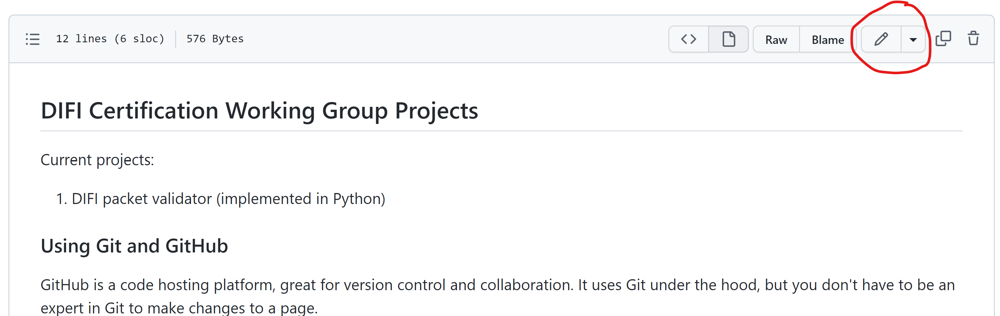

## DIFI Certification Working Group Projects

Current projects: 
1. DIFI packet validator (implemented in Python)

## Using Git and GitHub

GitHub is a code hosting platform, great for version control and collaboration.  It uses Git under the hood, but you don't have to be an expert in Git to make changes to a page.

### Making Changes to Text

To view code on a public GitHub repository (a.k.a. repo) like this one, you don't need a GitHub account.  You will need a GitHub account to suggest edits to a page.  For making documentation or other text changes, you can do everything from the browser.

In the portion of the page shown below, you can browse the files and directories/folders within this repo (you may see a slightly different set of files and folders).  Note that the Readme you see when you go to the repo's main page, is the README.md file.  Try browsing through some of the files and folders.

To edit a file, click it, then click the pencil icon circled  below:

You will be brought to an in-browser text editor, where you can make your edit.  Note the Preview tab at the top, to preview your changes.  

When you're done making the edits, scroll to the bottom and under Propose Changes you need to fill out the first bar, with a summary of the change.  You can leave the large box empty.  Click Propose Changes.

Click the Create Pull Request button as shown below

This will bring you to the Open a Pull Request window, which might seem confusing, but all you have to do is click the green Create Pull Request button at the bottom.  

At this point the maintainers of the code will likely receive an email that there is a new change request, known as a "pull request", and they will review it.  You might receive emails related to the review process on the email you used to create your GitHub account.
