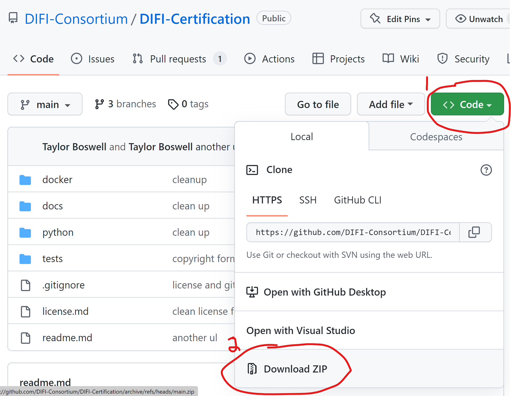
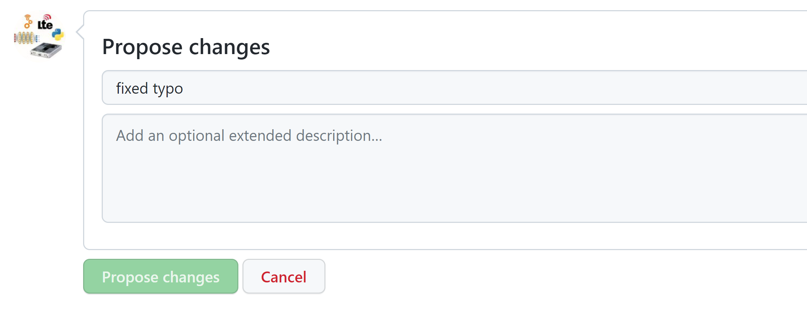
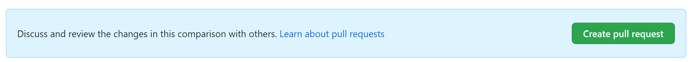

# DIFI Certification

  

Welcome to the Digital Intermediate Frequency Interoperability (DIFI) Certification GitHub Repo! This repository is used by the [DIFI Consortium Working Group](https://dificonsortium.org/) to share resources and tooling with DIFI Consortium members and the user community to enable verification, validation and testing of DIFI streams and devices in accordance with the [DIFI standards](https://dificonsortium.org/standards/).

## DIFI Certification Working Group Projects

### DIFI Python Packet Validator 
The Packet validator is a collection of [Python](https://www.python.org/ "Python") scripts that generate Standard Context' packets, 'Version Context' packets and 'Data' packets (dcs.py, dvs.py & dds.py) for consumption by a DIFI packet receiver (drx.py). The collection of scripts were released as open source by [Kratos Defense](https://www.kratosdefense.com/ "Kratos") to the DIFI Consortium. 

### DIFI GNU Radio Out of Tree blocks (gr-difi) 
The [GNU Radio](https://www.gnuradio.org/ "GNU Radio") out of tree blocks consist of a "Data" packet Source and Sink blocks and can be found in [gr-difi](https://github.com/DIFI-Consortium/gr-difi "gr-difi"). The collection of GNU Radio blocks were part of [gr-azure](https://github.com/microsoft/gr-azure "gr-azure") and released as open source by [Microsoft](https://www.Microsoft.com/ "Microsoft") to the DIFI Consortium.

### DIFI Wireshark Dissector 
The DIFI Wireshark Dissector is a LUA plugin created for [Wireshark](https://www.wireshark.org/ "Wireshark") that allows for packet inspection of DIFI Standard Context, Standard Data and Version Context packets. The plug-in was created by [Johanna Rivera](https://github.com/jo-rivera).

### DIFI Tutorials (Coming soon)
The tutorials section is a collection of educational material that describe DIFI packets and include hands on tutorials that combine the Python Packet Validator with gr-difi to illustrate the power of interoperability. 

### DIFI Certification software (Coming soon)
DIFI Certification software is a container based tool suite that allows for 1P & 3P certification of DIFI compliant devices and software.

## Using Git and GitHub

GitHub is a code hosting platform, great for version control and collaboration.  It uses Git under the hood, but you don't have to be an expert in Git to make changes to a page.

### Downloading the Code

From the browser, you can download the code by clicking the green Code button in the top right, and then clicking Download Zip, as shown below.

Those familiar with Git commands may choose to do the process with a `git clone` instead.  For a tutorial on using Git and GitHub via the command line, including creating your own repo, refer to [this series of tutorials](https://docs.github.com/en/get-started/quickstart).

### Making Changes to Text Using Your Browser

To view code on a public GitHub repository (a.k.a. repo) like this one, you don't need a GitHub account.  You will need a GitHub account to suggest edits to a page.  For making documentation or other text changes, you can do everything from the browser.

In the portion of the page shown below, you can browse the files and directories/folders within this repo (you may see a slightly different set of files and folders).  Note that the Readme you see when you go to the repo's main page, is the README.md file.  Try browsing through some of the files and folders.

To edit a file, click it, then click the pencil icon circled  below:

You will be brought to an in-browser text editor, where you can make your edit.  Note the Preview tab at the top, to preview your changes.

When you're done making the edits, scroll to the bottom and under Propose Changes you need to fill out the first bar, with a summary of the change.  You can leave the large box empty.  Click Propose Changes.

Click the Create Pull Request button as shown below

This will bring you to the Open a Pull Request window, which might seem confusing, but all you have to do is click the green Create Pull Request button at the bottom.

At this point the maintainers of the code will likely receive an email that there is a new change request, known as a "pull request", and they will review it.  You might receive emails related to the review process on the email you used to create your GitHub account.
