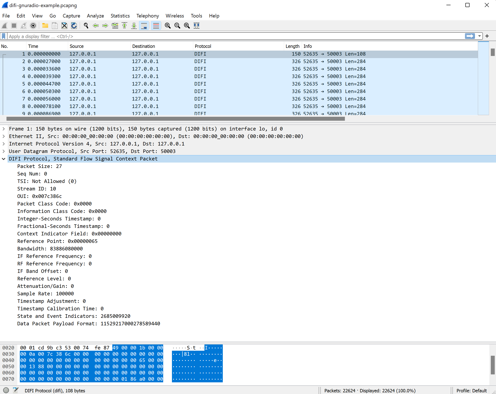

# DIFI Dissector

This project contains a [DIFI](https://dificonsortium.org/) dissector plugin for Wireshark. It supports decoding of Context, Data and Version packets as defined in v1.0.0 of the DIFI spec.

# Pre-requisites
* Install [Wireshark](https://www.wireshark.org/)

# Usage

Copy [difi-dissector.lua](difi-dissector.lua) into the Wireshark plugins directory (you may have to create the plugins directory). For Windows the directory should have the following path:

     `C:\Users\<username>\AppData\Roaming\Wireshark\plugins`

 If using Linux:

    `~./local/lib/wireshark/plugins`

* Run Wireshark
* Verify the plugin is loaded under Help->About Wireshark->Plugins
* Open a PCAP file with DIFI packets or use one of the example test files [difi-gnuradio-example](tests/difi-gnuradio-example.pcapng)

  

